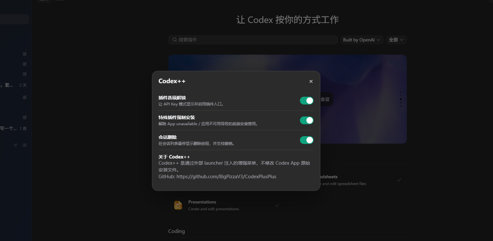

# Codex++

Codex++ 是一个面向 OpenAI Codex App 的外部增强启动器。它不修改 Codex App 原始安装文件，而是通过外部 launcher 启动 Codex，并使用 Chromium DevTools Protocol 向渲染进程注入增强脚本。

## 原作者与来源

本项目参考并二次封装自 BigPizzaV3 大佬的开源项目：

- 原项目地址：[https://github.com/BigPizzaV3/CodexPlusPlus](https://github.com/BigPizzaV3/CodexPlusPlus)
- 原作者：BigPizzaV3

感谢原作者提供 Codex++ 的核心思路、启动逻辑、CDP 注入方案和会话删除能力。本仓库主要整理了 README、macOS/Windows 便携发布包，以及 Windows portable 构建脚本，方便普通用户直接下载使用。

## 功能

- 在 Codex 会话列表悬停显示“删除”按钮
- 删除前确认，支持撤销
- 优先尝试服务端删除；不可用时删除本地 Codex SQLite 会话记录
- 在顶部菜单栏加入 `Codex++` 菜单
- 支持插件选项解锁
- 支持特殊插件强制安装开关
- 支持会话删除开关
- 支持 macOS `.app` 启动
- 支持 Windows x64 portable `.exe` 启动

## 效果预览

API Key 登录模式下，Codex 原生插件入口会提示需要登录 ChatGPT，导致插件功能无法正常使用：


Codex 原生会话列表只有归档入口，没有真正的删除按钮：


Codex++ 启动后会解锁插件入口，并在会话列表悬停时显示删除按钮：


顶部菜单栏会出现 `Codex++`，点击后可以打开配置界面：




## 下载

本仓库已包含预打包文件：

- macOS Apple Silicon：[packages/Codex++-macOS-arm64.zip](packages/Codex++-macOS-arm64.zip)
- Windows x64 portable：[packages/Codex++-Windows-x64-portable.zip](packages/Codex++-Windows-x64-portable.zip)

如果 GitHub 页面不方便直接下载大文件，也可以克隆仓库后在 `packages/` 目录中找到它们。

## macOS 使用

1. 下载 `packages/Codex++-macOS-arm64.zip`
2. 解压得到 `Codex++.app`
3. 将 `Codex++.app` 放到 `/Applications` 或任意目录
4. 双击 `Codex++.app` 启动

如果 macOS 提示应用来自未知开发者，可以在“系统设置 -> 隐私与安全性”中允许运行，或在终端执行：

```bash
xattr -dr com.apple.quarantine /Applications/Codex++.app
```

当前 macOS 包为 Apple Silicon arm64 构建。

## Windows 使用

1. 下载 `packages/Codex++-Windows-x64-portable.zip`
2. 解压整个文件夹
3. 确保 Windows 已安装 Codex App
4. 双击文件夹里的 `Codex++.exe`

不要只复制单个 `Codex++.exe`。Windows 便携包依赖同目录内的 `python/`、`app/` 和 `vendor/` 文件夹。

## 工作方式

Codex++ 使用外部启动方式运行 Codex：

1. 启动 Codex App，并附加远程调试参数
2. 启动本地 helper 服务，用于删除和撤销会话
3. 通过 CDP 注入 `renderer-inject.js`
4. 渲染端通过 CDP bridge 与本地 helper 通信，避免被 Codex 页面 CSP 拦截

这种方式不会修改 Codex 的 `app.asar`，也不需要往 Codex 安装目录写入 DLL。

## 从源码运行

环境要求：

- Python 3.11+
- macOS 或 Windows
- 已安装 Codex App

安装依赖：

```bash
python -m pip install -e .
```

直接启动：

```bash
python -m codex_session_delete launch
```

运行测试：

```bash
python -m pip install -e .[test]
python -m pytest -q
```

## 自行构建 Windows 便携包

Windows 上双击：

```text
build-windows-portable.bat
```

或在 macOS/Linux/Windows 执行：

```bash
python scripts/build_windows_portable.py
```

构建完成后会生成：

```text
dist/Codex++-win-portable/Codex++.exe
```

便携包内置 Windows embeddable Python、依赖、`codex_session_delete` 包和同一份 `renderer-inject.js`，所以顶部 `Codex++` 菜单、插件解锁、特殊插件强制安装、会话删除、确认与撤销行为会和 macOS `.app` 版本保持一致。

## Windows 快捷方式安装

如果不使用 portable 包，也可以在源码目录双击：

```text
setup.bat
```

菜单选项：

```text
[1] Install Codex++
[2] Uninstall Codex++
[3] Exit
```

命令行安装：

```bash
python -m codex_session_delete setup
```

命令行卸载：

```bash
python -m codex_session_delete remove
```

同时删除 Codex++ 自己的日志和备份数据：

```bash
python -m codex_session_delete remove --remove-data
```

## 数据与日志

Codex++ 默认读取 Codex 本地数据库：

```text
~/.codex/state_5.sqlite
```

删除前会把相关记录备份到：

```text
~/.codex-session-delete/backups
```

隐藏启动失败日志位于：

```text
~/.codex-session-delete/launcher.log
```

Windows 对应路径通常在：

```text
%USERPROFILE%\.codex-session-delete\launcher.log
```

## 常见问题

### 双击没反应

先查看日志：

```text
~/.codex-session-delete/launcher.log
```

Windows：

```text
%USERPROFILE%\.codex-session-delete\launcher.log
```

常见原因：

- Codex App 没有安装
- Codex App 安装路径变化
- 远程调试端口被占用
- Windows portable 包没有完整解压

### Codex++ 菜单没出现

请确认你是通过 `Codex++` 启动，而不是直接启动原版 Codex。

### Windows portable 能不能只发 exe

不能。`Codex++.exe` 是便携启动器，运行时依赖同目录的 Python runtime、依赖库和项目代码。请完整分发 `Codex++-Windows-x64-portable` 文件夹或 zip。

## 项目结构

```text
codex_session_delete/
  cli.py                 CLI 入口
  launcher.py            启动 Codex 并注入脚本
  cdp.py                 CDP 通信与 bridge
  helper_server.py       本地 helper 服务
  storage_adapter.py     本地 SQLite 删除/撤销
  windows_installer.py   Windows 快捷方式与卸载项
  macos_installer.py     macOS app bundle 安装
  inject/renderer-inject.js

scripts/
  build_windows_portable.py

packages/
  Codex++-macOS-arm64.zip
  Codex++-Windows-x64-portable.zip

tests/
  自动化测试
```

## 说明

Codex++ 是外部增强工具，不修改 Codex App 原始文件。Codex App 更新后，如果页面结构变化，可能需要更新注入脚本。

本仓库是参考原作者项目整理和封装的版本。核心创意与主要实现来自 BigPizzaV3 的 [CodexPlusPlus](https://github.com/BigPizzaV3/CodexPlusPlus)。如需了解原始项目、提交 issue 或查看最新上游进展，请优先访问原仓库。
